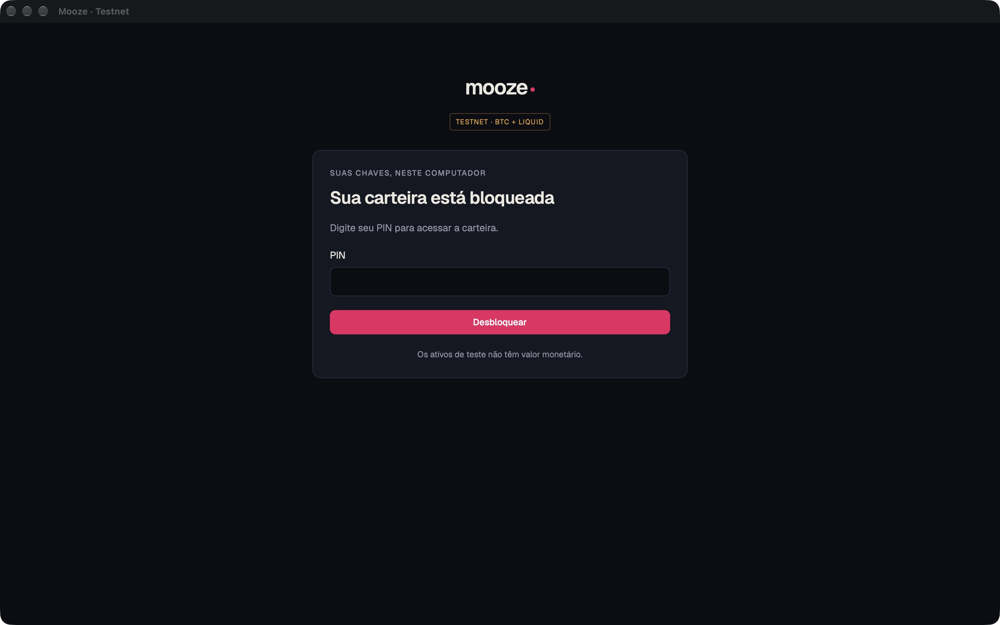

# Mooze desktop testnet MVP

The desktop client uses Tauri 2, React 19, and the existing `mooze_app` facade. It imports one English BIP39 wallet and supports Bitcoin testnet3 and Liquid testnet. There is no mainnet switch.

## Run on macOS

Install the Rust toolchain, Node 22+, npm, and Xcode command-line tools, then run from the repository root:

```sh
npm ci
npm run desktop:dev
```

For an application bundle:

```sh
npm run desktop:build
# Faster, unoptimized local validation:
npm exec -w @mooze/desktop -- tauri build --debug --bundles app
```

The bundle appears under `apps/desktop/src-tauri/target/{release,debug}/bundle/macos/`. Distribution signing, notarization, and an updater are outside this MVP. Windows and Linux are not yet verified.

Use a dedicated testnet recovery phrase. Import requires a six-digit PIN. Each process starts locked; losing window focus or pressing **Bloquear carteira** locks it immediately. After five incorrect PIN attempts, a persisted 30-second delay applies. The application never erases the wallet for failed authentication.

## Architecture and data

- `apps/frontend`: Mooze CSS, unstyled Base UI buttons/dialogs and native semantic controls. Fonts are bundled from pinned Fontsource packages. The frontend's `DesktopClient` interface separates presentation from Tauri.
- `apps/desktop/src-tauri`: a narrow allowlist of commands, authorization, OS storage, sync events and send reviews. No generic facade dispatcher, filesystem command, or secret-store command is exposed to the webview.
- `crates/mooze-app`: shared application facade and runtime. Per-chain sync events are additive; the Flutter bridge remains compatible.
- `crates/mooze-core`: network-aware Liquid policy classification, bounded transaction fees, and a pre-sign authorization callback.

Non-secret wallet state lives in the Tauri app-data directory for `app.mooze.desktop.testnet`, under `testnet/wallet.json`. Writes serialize an atomic map replacement; Unix directory/file permissions are 0700/0600. Secrets live in the OS credential service `app.mooze.desktop.testnet`, item `wallet-secrets`, as one atomically updated map. There is no plaintext fallback. The PIN gates application operations; OS credential access controls protect the stored secret. Import/unlock form values are kept out of query caches.

The imported mnemonic has an empty BIP39 passphrase, matching mobile. Existing Bitcoin derivation intentionally keeps coin type `0h` on testnet for compatibility; Liquid uses the core's testnet descriptors. Testnet balances are not priced in BRL. Unknown Liquid assets retain their IDs and show raw units, with no guessed decimal precision.

The default endpoints are inherited from the core:

| Chain | Endpoint |
| --- | --- |
| Bitcoin testnet3 | `ssl://electrum.blockstream.info:60002` |
| Liquid testnet | `ssl://blockstream.info:465` |

The runtime refreshes every 60 seconds, with per-chain timeouts. Sync continues while locked, but wallet events are suppressed and UI caches are cleared. A failed chain is displayed independently; an unsynchronized balance is not shown as a confirmed zero.

## Sending

Enter a testnet address, amount using a decimal comma, and an explicit fee rate. The initial fee rates are editable defaults, not live estimates. Review expires after 60 seconds and is bound to the session. Confirmation accepts only an opaque review ID, consumed once.

The core checks the fee of the transaction it will sign against the reviewed maximum. A lock during preparation revokes signing authorization. Once signing starts, a later lock cannot revoke an already submitted transaction. A lost broadcast response is shown as an uncertain result; the application never automatically repeats a send. Refresh history before deciding whether to submit another transaction.

## Verification

```sh
npm run frontend:test
npm run frontend:typecheck
npm run frontend:build
cargo test --locked --manifest-path crates/mooze-core/Cargo.toml --features electrum,http-reqwest
cargo test --locked --manifest-path crates/mooze-app/Cargo.toml --features codegen,electrum,http-reqwest
cargo test --locked --manifest-path apps/desktop/src-tauri/Cargo.toml --features codegen
cargo check --locked --manifest-path packages/mooze_core_bridge/rust/Cargo.toml
```

Regenerate facade types with its `codegen` binary; regenerate host DTOs using `npm run codegen -w @mooze/desktop`. Both have freshness tests. The desktop CI job runs on macOS.

The explicitly ignored `native_smoke` integration test uses a random test wallet, a temporary directory, and an isolated OS credential item. It checks actual import, Keychain persistence, restart lock, receive, and public testnet synchronization. It never submits a transaction:

```sh
cargo test --manifest-path apps/desktop/src-tauri/Cargo.toml --test native_smoke -- --ignored --nocapture
```

Validation results and native screenshots are recorded below after verification. Automated tests do not prove a funded broadcast or confirmation.

## Scope

Included screens: import/unlock, Home, assets, history/details, receive, send/review/result, and minimal security/settings. This slice excludes wallet creation, custom nodes, PIX, swaps, pegs, wallet levels, merchant tools, fiat pricing, browser-wallet support, and release distribution. These remain later desktop work, not removed product requirements.

## Validation record — 2026-10-06

Environment: macOS arm64, Rust 1.98.0, Node 22.12.0; Tauri 2.12.1, React 19.3.0 (exact dependencies and lockfiles committed with the source).

- Shared core native-feature suite: 321 passed, 1 pre-existing ignored test, plus the golden migration fixture; existing mainnet/address fixtures remain unchanged.
- Facade: 30 unit tests, golden migration, and generated binding freshness passed.
- Frozen Flutter bridge compiled; all 679 mobile tests passed.
- Desktop host: 18 tests passed, including storage failure recovery, lock races, independent chain health, one-use reviews, safe integers, and persisted unresolved sends.
- Frontend: 15 tests passed; TypeScript and production bundle passed. Frontend JS is approximately 426 kB (132 kB gzip), plus bundled fonts/CSS.
- A real debug macOS `.app` was built (106.82 MiB) and its locked window inspected. This is an unoptimized debug artifact, not a release-size measurement.
- The isolated native smoke test passed using the actual Keychain and configured public testnet servers: import/persistence about 0.80 seconds; receive addresses for both chains; locked restart and PIN unlock; both chains successfully synced by 8.44 seconds. These are one local debug run, not a performance benchmark or a cold webview-launch measurement.



The normal app profile already contained a locked wallet, so its credentials and balances were not used for verification. The native smoke test used a separate random wallet and disposable credential item. A complete interactive walkthrough of the unlocked screens, minimum-window visual QA, offline/reconnect GUI behavior, and funded network broadcasts/confirmations remain unverified. No transaction ID or confirmed-send claim is recorded. The offline funded Liquid fixture verifies confidential transaction construction/signing, testnet policy identity, exact/exceeded fee limits, revoked authorization, and uncertain broadcast classification. Unit tests and local signing fixtures are not substitutes for funded public-chain checks.

## Polished testnet validation

The expanded wallet UI and final review findings are recorded in
[testnet-polish-validation.md](testnet-polish-validation.md). Funded checks now use
an opt-in [Nigiri regtest harness](../tools/wallet-regtest/README.md) on OrbStack.
This exercises shared wallet mechanics without changing the approved public
TEST asset or claiming mainnet/distribution readiness.

## Everyday wallet UI validation

See [the Quiet Navy implementation and validation report](everyday-wallet-validation.md) for current frontend changes, native observations, independent review fixes, and remaining acceptance gaps.
